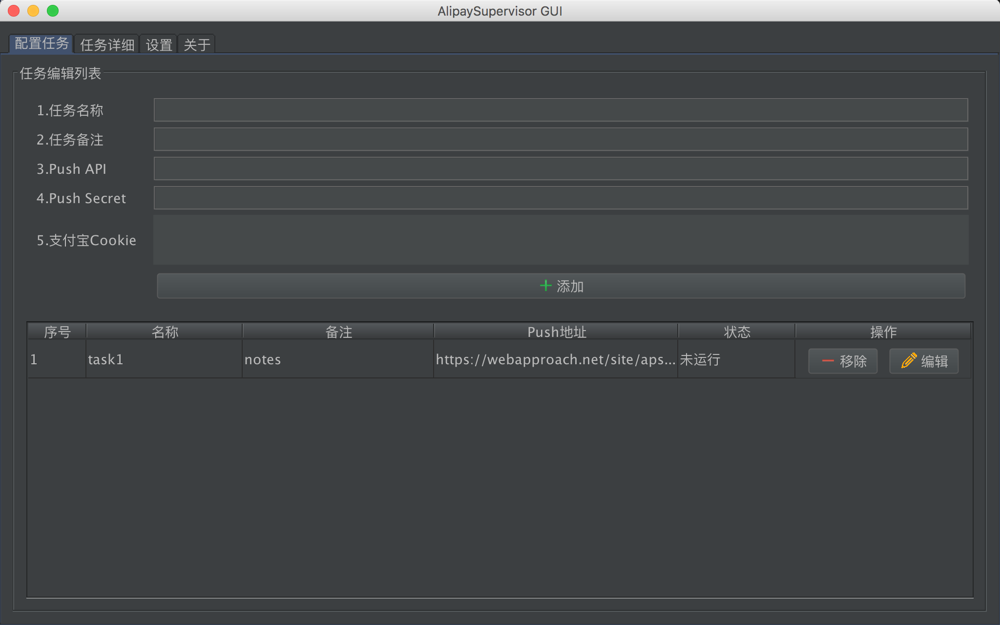
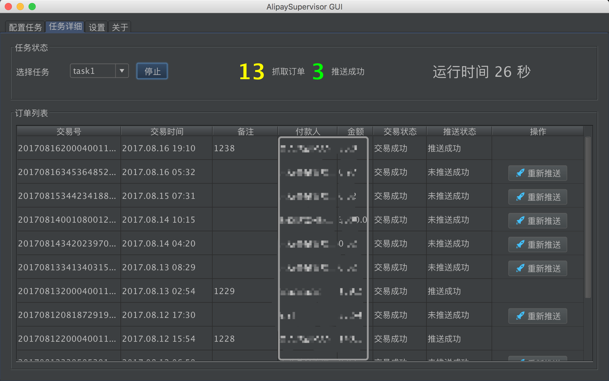
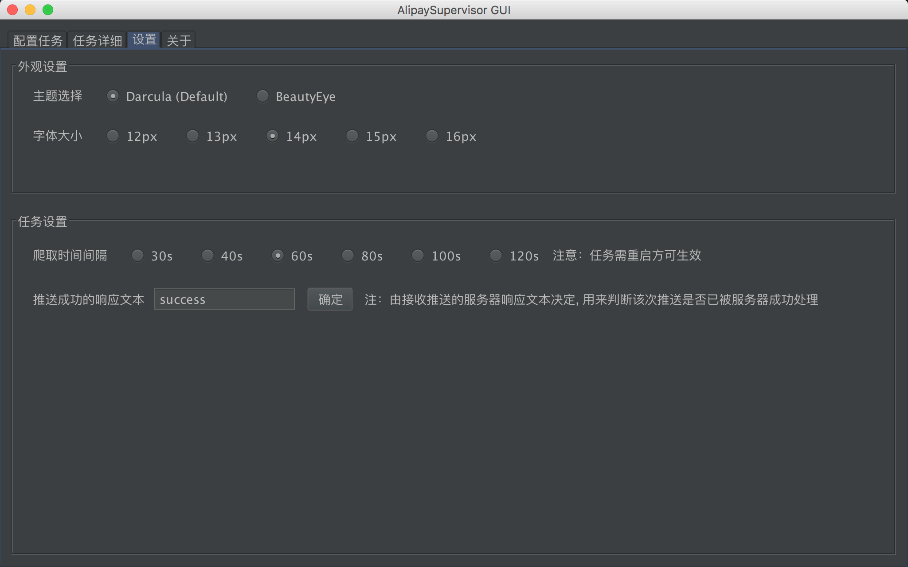
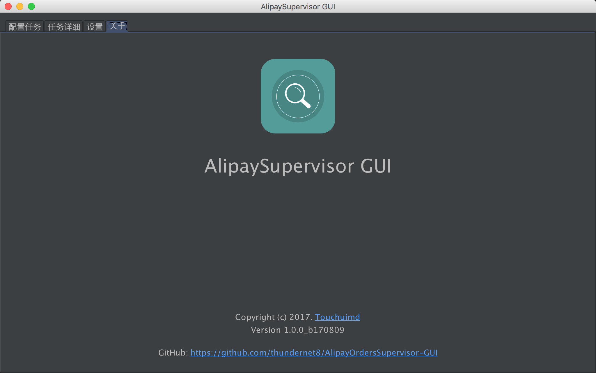

## AlipayOrdersSupervisor-GUI
[AlipayOrdersSupervisor](https://github.com/thundernet8/AlipayOrdersSupervisor) 的GUI版本，由Java+Swing编写，maven实现包管理，运行环境JVM8+

刚刚学习Java一周，涉及到Java核心技术卷一较多知识，拿来练手

## 截图

## 编译注意

### ***安装本代码引用的非maven包，注意路径改成自己的***

### darcula
mvn install:install-file -Dfile=/Users/WXQ/Desktop/APSV-GUI/src/main/lib/darcula.jar -DgroupId=com.darcula -DartifactId=darcula-lnf -Dpackaging=jar -Dversion=1.0 -DgeneratePom=true -DcreateChecksum=true

### beautyeye
mvn install:install-file -Dfile=/Users/WXQ/Desktop/APSV-GUI/src/main/lib/beautyeye_lnf.jar -DgroupId=com.beautyeye -DartifactId=beautyeye-lnf -Dpackaging=jar -Dversion=1.0 -DgeneratePom=true -DcreateChecksum=true

## 使用注意

jar包可自己编译生成，服务端请参考com.wxq.apsv.utils.Order生成签名的方法，对应验证数据合法性后进行业务处理